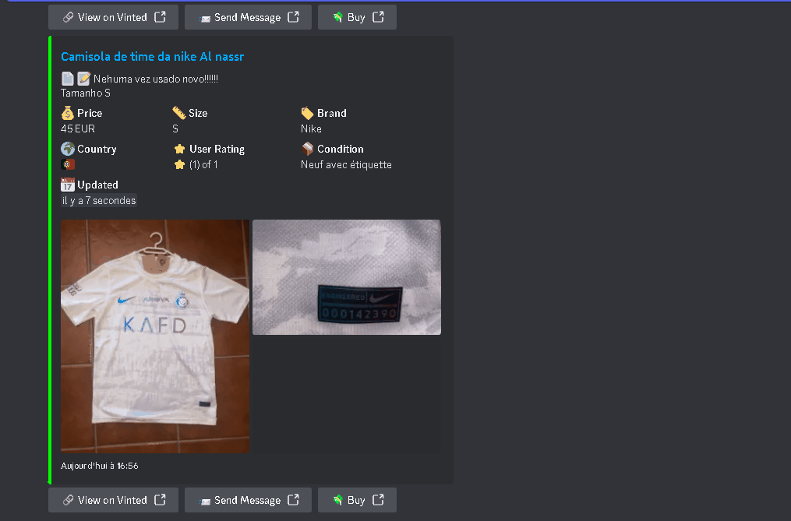
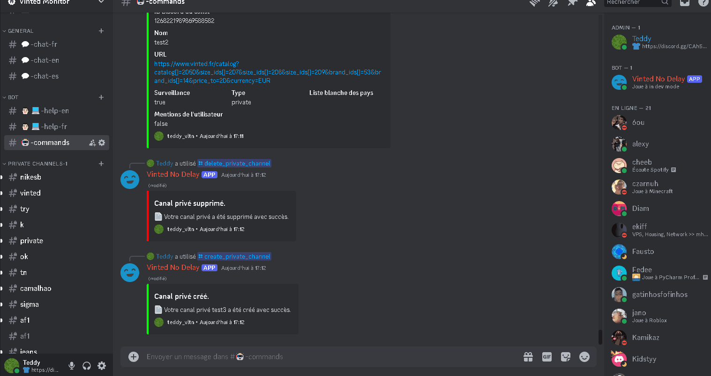
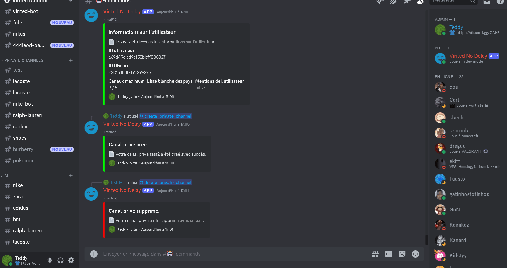
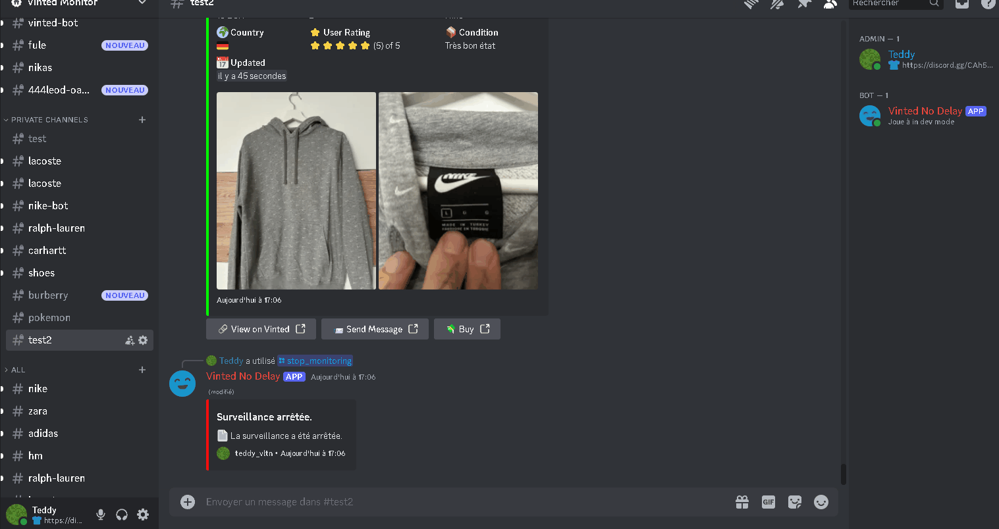
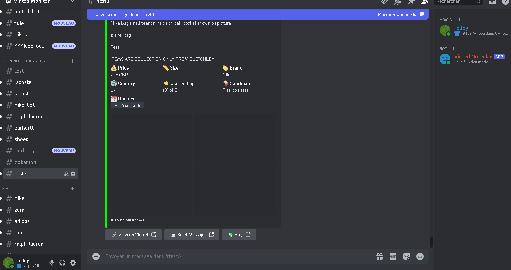

# Vinted Monitor - No Delay

Vinted Monitor is a bot that monitors the Vinted items route for new items and notifies users in real-time. It is designed to work with minimal delay, ensuring that users are always up-to-date with the latest items. Ideal for people who wants to start a reselling discord service or community to make some money.

---
> [!TIP]
> [Discord Invite](https://discord.gg/CDv9b8cPXU) - Join if you want: preview of the bot, simply to use the bot freely or if you need help.
---

<p align="center">
  
</p>

## Table of Contents
1. [Features](#features)
2. [Requirements](#requirements)
3. [Setup](#setup)
    - [Clone the Repository](#clone-the-repository)
    - [Create a Discord Bot](#create-a-discord-bot)
    - [Modify the Configuration File](#modify-the-configuration-file)
    - [Run Docker](#run-docker)
    - [Database Access](#database-access)
    - [Stop the Bot](#stop-the-bot)
4. [Usage](#usage)
5. [Showcase](#showcase)
    - [Create a Public Channel](#create-a-public-channel)
    - [Create a Private Channel](#create-a-private-channel)
    - [Start Monitoring in a Private Channel](#start-monitoring-in-a-private-channel)
    - [Enable mentions in a Private Channel](#enable-mentions-in-a-private-channel)

## Use the bot for free 

The bot is running for free on a public discord server that you can access if you don't want to painfully try to install the bot that can be found by [clicking here](https://discord.gg/CDv9b8cPXU)
- You can also help this bot running longer and contribute to the development somehow by [clicking here](https://buymeacoffee.com/teddyvltn)
- You can also buy a membership to have a private version of this bot running on your own server that I will personnaly host by [clicking here](https://buymeacoffee.com/teddyvltn/membership)

## Features

- **Real-time Monitoring**: Vinted Monitor fetches the latest items from the Vinted items route in real-time.
- **Discord Integration**: The bot integrates with Discord and can send notifications to specific channels.
- **Commands**: The bot supports a variety of commands that allow users to interact with it.
- **Database Channel/User Management**: The bot can manage channels and users in a database, allowing for easy management of notifications.
- **Language Support**: The bot will communicate with users in their set Discord language. (If available, you can add your own translations in the `locales` folder.)

## Requirements

- VPS running on a Linux kernel or you own computer (avoid Windows if possible)
- Rotating proxy
> [!NOTE]
> You can buy rotating proxies here: [WebShare](https://www.webshare.io/?referral_code=eh8mkj0b6ral) (I get a small cut from that link so please use it if you want to support my work). I would advice you to get the "Verified Proxy" Plan and to take 100 proxy server with 1000 GB/month Bandwidth which is 7.07$/month, but i would highly suggest you take the 250 proxy server and 5000GB plan ($25.73 per month) if you want to have a good speed and avoid skipping items the most you can.
- Docker installed (https://docs.docker.com/engine/install/)
- Some knowledge with Docker, JS and MongoDB
- Git installed (optional)

## Setup

1. Clone the repository from terminal or download through Github.

```bash
git clone https://github.com/teddy-vltn/vinted-monitor.git
cd vinted-monitor
```

2. Create a Discord bot in Discord's Developer Portal and invite it to your server:

- Go to the [Discord Developer Portal](https://discord.com/developers/applications).
- Click on "New Application" and give your bot a name.
- Go to the "Bot" tab and click on "Add Bot".
- Copy the "Client ID" and "Token" and paste them into the `.env` file.
- Give intent permissions to the bot by going to the "Bot" tab and enabling the "Presence Intent", "Server Members Intent" and "Content Message Intent".
- Invite the bot with admin permissions to your server by going to the "OAuth2" tab and selecting the "bot" and "application.commands" scope and the "Administrator" permission.
- Copy the generated URL and paste it into your browser to invite the bot to your server.

3. Modify the configuration file `.env`:

### Environment Variables Description

- **DISCORD_CLIENT_ID**: The client ID of your Discord bot, obtained from the Discord Developer Portal.
- **DISCORD_TOKEN**: The token for your Discord bot, obtained from the Discord Developer Portal.
- **DISCORD_ADMIN_ID**: The user ID of the bot owner, who can create public channels.
- **WEBSHARE_API_KEY**: The Webshare API key to use.

6. Make sure you have docker installed on your machine or [Install Docker](https://docs.docker.com/engine/install/) and run the following command:

> [!IMPORTANT]
> If you are on Windows, make sure you have WSL2 alongside Docker Desktop to run the following command. You will also certainly need to activate virtualization in your BIOS.

Make sure the start.sh has permission to execute.
```bash
chmod +x start.sh
```

```bash
./start.sh
```

> [!IMPORTANT]
> If along the way you happen to modify the `.env` file or files in the other folders, you will need to rebuild the docker image by running the command above.

5. The bot should now be running and ready to use. And enjoy! (if it ain't working you can come to the discord server for help https://discord.gg/CDv9b8cPXU)

?. If you want to stop the bot, you can run the following command:

Make sure the stop.sh has permission to execute.

```bash
chmod +x stop.sh
```

```bash
./stop.sh
```

## Usage

The bot supports a variety of commands that allow users to interact with the bot. Here are some of the available commands:
- `/create_public_channel`: Creates a public channel for the bot to send notifications.
- `/create_private_channel`: Creates a private channel for a user for the bot to send notifications.
- `/delete_public_channel`: Deletes a public channel.
- `/delete_private_channel`: Deletes a private channel.
- `/start_monitoring`: Starts monitoring the Vinted items route.
- `/stop_monitoring`: Stops monitoring the Vinted items route.
- `/set_mentions`: Sets the preferences for mentions in notifications.
- `/add_country`: Adds a country to the list of monitored countries.
- `/remove_country`: Removes a country from the list of monitored countries.
- `/info`: Displays information about Channel/User.
- `/set_max_channels`: Sets the maximum number of private channels a user can create.

## Showcase 

### Create a Public Channel

<p align="center">
  
</p>

### Create a Private Channel

<p align="center">
  
</p>

### Start Monitoring in a Private Channel

<p align="center">
  
</p>

### Enable mentions in a Private Channel

<p align="center">
  
</p>
