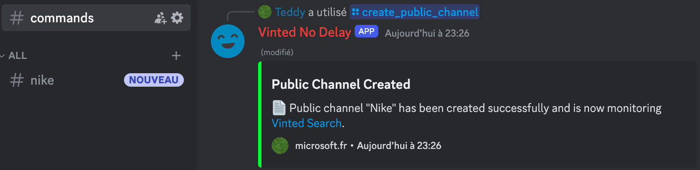
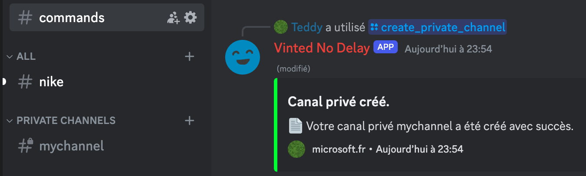
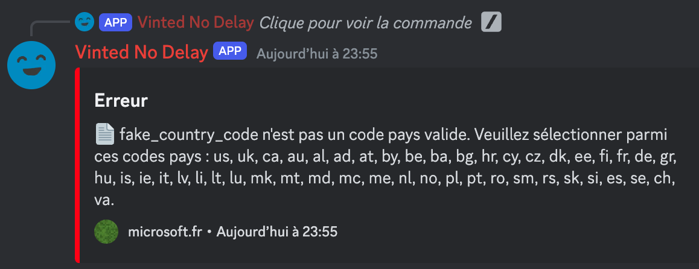
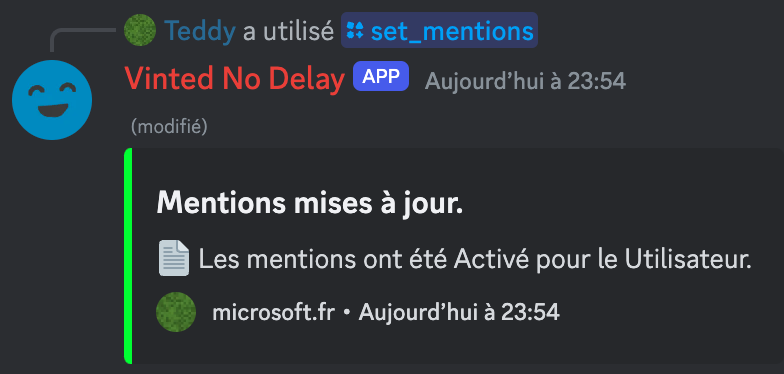

# Vinted Monitor - No Delay

Vinted Monitor is a bot that monitors the Vinted items route for new items and notifies users in real-time. It is designed to work with minimal delay, ensuring that users are always up-to-date with the latest items.

<p align="center">
  
</p>

## Features

- **Real-time Monitoring**: Vinted Monitor fetches the latest items from the Vinted items route in real-time.
- **Discord Integration**: The bot integrates with Discord and can send notifications to specific channels.
- **Commands**: The bot supports a variety of commands that allow users to interact with it.
- **Database Channel/User Management**: The bot can manage channels and users in a database, allowing for easy management of notifications.
- **Language Support**: The bot will communicate with users in their set Discord language. (If available, you can add your own translations in the `locales` folder.)

## Setup

1. Clone the repository and install the dependencies:

    ```bash
    git clone https://github.com/teddy-vltn/vinted-monitor.git
    cd vinted-monitor-no-delay
    ```

2. Modify the configuration file `.env` to suit your needs:

> [!NOTE]
> This bot will require you to have a rotating proxy service due to high request rates. You can buy one here: [WebShare](https://www.webshare.io/?referral_code=eh8mkj0b6ral). It's very cheap if you take the 100 proxy server and 1000GB plan ($5.49 per month).

    ```env
    # Your discord bot client id and token
    DISCORD_CLIENT_ID="1234567890123456789"
    DISCORD_TOKEN="MTIzNDU2Nzg5MDEyMzQ1Njc4OTAxMjM0NTY3ODkwMTIzNDU2Nzg5"

    # The user id of the bot owner, the one that will be able to create public channels
    DISCORD_ADMIN_ID="987654321098765432"

    # Don't change that unless you know what you are doing
    MONGODB_URI="mongodb://mongodb:27017/vinted"

    # Generate a good password and username https://www.avast.com/random-password-generator
    MONGO_EXPRESS_USERNAME="fakeUser12345"
    MONGO_EXPRESS_PASSWORD="FakePassword67890"

    # Max number of private channels a user can create
    USER_MAX_PRIVATE_CHANNELS_DEFAULT=5

    # Max requests in the queue (more concurrent requests = more requests per second = more memory usage)
    ALGORITHM_CONCURRENT_REQUESTS=20

    # Rotating proxy settings config (use a socks proxy http proxy are not supported)
    # Get cheap proxies here : https://www.webshare.io/?referral_code=eh8mkj0b6ral
    PROXY_HOST="fakeproxy.webshare.io"
    PROXY_PORT="8080"
    PROXY_USERNAME="fakeProxyUser"
    PROXY_PASSWORD="fakeProxyPassword"
    ```

3. Make sure you have docker installed on your machine or [Install Docker](https://docs.docker.com/engine/install/) and run the following command:

    ```bash
    docker-compose up -d --build
    # OR
    sudo docker-compose up -d --build
    ```

> [!NOTE]
> You can also connect the bot to your own database by modifying the `.env` file, and by running simply by node by running `npm start`.

4. The bot should now be running and ready to use. And enjoy! (if it ain't working you can come to the discord server for help https://discord.gg/CDv9b8cPXU)

> [!NOTE]
> If you want to access the database, you can use the MongoDB Express interface by going to `http://localhost:8081` and logging in with the credentials you set in the `.env` file.

## Usage

The bot supports a variety of commands that allow users to interact with the bot. Here are some of the available commands:
- `/create_public_channel`: Creates a public channel for the bot to send notifications.
- `/create_private_channel`: Creates a private channel for a user for the bot to send notifications.
- `/delete_public_channel`: Deletes a public channel.
- `/delete_private_channel`: Deletes a private channel.
- `/start_monitoring`: Starts monitoring the Vinted items route.
- `/stop_monitoring`: Stops monitoring the Vinted items route.
- `/set_mentions`: Sets the preferences for mentions in notifications.
- `/add_country`: Adds a country to the list of monitored countries.
- `/remove_country`: Removes a country from the list of monitored countries.

## Some usage examples

- **I want to create a public channel where people on my server can see the monitored URL.**

  <p align="center">
    
  </p>

- **I want to create a private channel where I can see the monitored URL.**

  <p align="center">
    
  </p>

- **I want to make a whitelist of countries that I want to monitor but I misspell the country code.**

  <p align="center">
    
  </p>

- **I want to set mentions so I get a notification when a new item is found.**

  <p align="center">
    
  </p>

## Database Schema

The bot uses a database to manage channels and users. Here is the schema for the database:

<p align="center">
  
</p>

In this schema, preferences are a JSON object that stores the preferences for the user. When a user creates a channel, their preferences will transfer to the channel, but individual channel preferences will override the user preferences.

Available preferences:
- Countries: A list of countries to monitor.
- Language: The language of the notifications.
- Currency: The currency of the notifications.
- Mention: The mention preferences for the notifications.

> [!NOTE]
> Some preferences aren't fully supported yet.

## Regarding AutoBuy

The bot does not support autobuying items. It is designed to monitor the Vinted items route for new items and notify users in real-time. Users can then manually purchase the items they are interested in.

AutoBuy can be extremely dangerous and can lead to account suspension or even legal action. We do not condone the use of AutoBuy and will not provide support for it.

By giving access to your OAuth2 token, you are putting yourself at risk.
