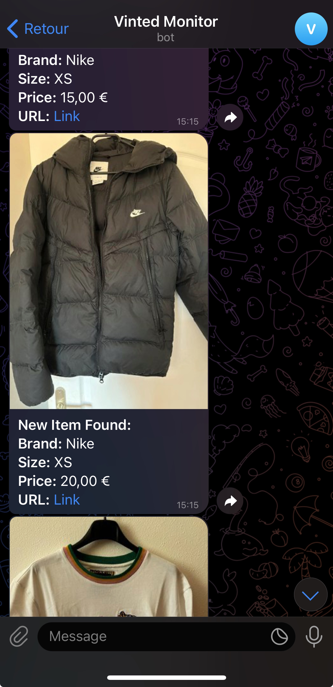

# VintedMonitor - Monitor Vinted for New Listings

## Overview
--------

The `VintedMonitor` simplifies the process of monitoring Vinted for new listings. IT IS NOT AN API WRAPPER. It uses `selenium-webdriver` to scrape the Vinted website, so it is subject to breakage if Vinted changes its website structure. But will get updated as soon as possible if that happens.

It allows you to specify the catalog, brands, sizes, and price range of items you are interested in and will notify you in real-time when new items are found.

## Data

The overall vinted database has been roughly collected from the Vinted website and stored in JSON files in the `data` directory. 

Last updated: `13th April 2024`

## Getting Started
---------------

### Installation

Ensure that you have the required packages installed. If not, you can install them using npm:

```bash
npm install
```

### Running the Monitor

To run the monitor and test the main.js file, use the following command:

```bash
npm run start
```

You also have a way to run the monitor in a telegram bot using the following command:

```bash
npm run telegram
```

If you want to know about how to create a Telegram Bot : https://core.telegram.org/bots/tutorial
Follow this tutorial to create your own bot and set your token in `config.json` file.

The base code for the telegram bot is in `telegram.js` file. It holds features like:
*   `/start` : To start the bot
*   `/config` : To see the current config
*   `/setbrands` : To set the brands. eg: `/setbrands Nike, Puma`
*   `/setsizes` : To set the sizes. eg: `/setsizes XS, S`
*   `/setprice` : To set the price range. eg: `/setprice 10-100`
*   `/watch` : To start watching the items.
*   `/stop` : To stop watching the items.

<p float="left">
    
</p>

### Files

- `vinted_monitor.js`: Contains the `VintedMonitor` class responsible for setting up and managing item monitoring on Vinted.

Usage
-----

To use the `VintedMonitor`, import it into your project and configure it with desired parameters:

### Simple Setup Example

Here's a basic example of how to set up and use the `VintedMonitor`:

```javascript
import { VintedMonitor } from './src/vinted_monitor.js';

async function main() {
    const vintedMonitor = new VintedMonitor('https://www.vinted.fr/catalog');

    await vintedMonitor.configure({
        order: 'newest_first',
        catalog: 'Tailles hommes',
        brands: ['Nike', 'Puma'],
        sizes: ['XS'],
        priceFrom: 10,
        priceTo: 100
    });

    vintedMonitor.startMonitoring(newItems => {
        console.log(`Found ${newItems.length} new items:`);
        newItems.forEach(item => console.log(item.toString()));
    }, 5000);  // Check every 5 seconds

    // Optionally, stop the watcher after some time
    setTimeout(() => {
        vintedMonitor.stopMonitoring();
    }, 3600000); // Stops after 1 hour
}

main();
```

### Configuration Options

*   `order`: Sort order of the items.
*   `catalog`: Specific catalog to monitor.
All the catalog options can be found in the `data/groups.json` file.
*   `brands`: Array of brands to filter items.
All the brands options can be found in the `data/brands.json` file.
*   `sizes`: Sizes to filter the items.
All the sizes options can be found in the `data/sizes.json` file.
*   `priceFrom`: Minimum price of items to monitor.
*   `priceTo`: Maximum price of items to monitor.

It uses `fuse.js` to search for the closest match to the provided values. So, if you provide a brand that is not in the list, it will still try to find the closest match. So no need to write the exact brand name or size or catalog name.

## Features
--------

*   **Real-time Monitoring**: Checks Vinted for new listings at specified intervals.
*   **Flexible Configuration**: Easy to specify what items to watch through simple configuration.
*   **Callback Functionality**: Provides real-time callbacks for new items found.

### Stopping the Monitor
--------------------

To stop the monitor after a certain period or based on specific conditions, use the `stopMonitoring` method.

## Contributions
-------------

Contributions are welcome. Please submit a pull request or issue on our GitHub repository.

## Troubleshooting

If you encounter any issues, please check the following:
*   Ensure that you have the required packages installed.
*   If it is selenium related: https://stackoverflow.com/questions/26191142/selenium-nodejs-chromedriver-path
*   If it is related to the Vinted website structure, please wait for an update or submit an issue.