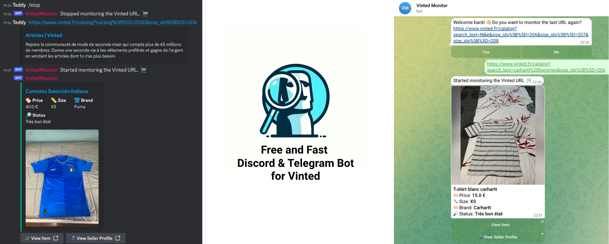

For a quick trial, use the showcase bot available at this link: [https://web.telegram.org/k/#@vinteditemsbot](https://web.telegram.org/k/#@vinteditemsbot) or search for `@vinteditemsbot` on Telegram.

> [!NOTE]  
> The showcase bot may not be available 24/7. For continuous use, consider deploying your own instance.

Quick Navigation
----------------

*   **[Using the Telegram Bot](#using-the-telegram-bot)** - Start here to use the pre-configured bot or set up your own.
*   **[Setting Up the Discord Bot](#setting-up-the-discord-bot)** - Follow these instructions to add a Discord bot feature.
*   **[Remaining Setup](#remaining-setup)** - Configure the bot with your preferences and start monitoring Vinted
*   **[Using proxy servers](#using-proxy-servers)** - Learn how to use proxy servers for monitoring Vinted.
*   **[Troubleshooting](#troubleshooting)** - Find solutions to common issues and get help from the community.

Using the Telegram Bot
----------------------


### Deploy Your Own Telegram Bot

Clone the repository to get started:

```shell
git clone https://github.com/teddy-vltn/vinted-monitor
```

or download the ZIP file [Direct Download](https://github.com/teddy-vltn/vinted-monitor/archive/refs/heads/main.zip).

#### Configuration

Configure your bot in `config.yaml` using the token obtained from BotFather on Telegram. Here's a guide to [creating a Telegram Bot](https://core.telegram.org/bots/tutorial).

```yaml
telegram:   
  token: "YOUR_TELEGRAM_TOKEN"
```

Install dependencies and start your bot using:

```shell
npm install 
npm run telegram
```

#### Available Commands

*   `/start` - Start the bot and receive a welcome message. It will walk you through the setup process.
*   `/stop` - Stop the bot and receive a goodbye message.

Setting Up the Discord Bot
--------------------------


To add a Discord bot to the Vinted Monitor, update the `config.yaml` with your Discord bot token. Obtain a token from the Discord Developer Portal.

```yaml
discord:   
  token: "YOUR_DISCORD_TOKEN"
```

#### Start the Bot

Install dependencies and start your bot using:

```shell
npm install
npm run discord
```

#### Available Commands

*   `/start` - Start the bot and receive a welcome message. It will walk you through the setup process.
*   `/stop` - Stop the bot and receive a goodbye message.

### Remaining Setup

Regardless of the platform (Telegram or Discord), set your item check interval and proxy settings in `config.yaml`:

```yaml
interval: 3 # Interval in seconds for checking new items on Vinted

use_proxies: false # Set to true if you want to use a proxy server

# List of proxy configurations for handling multiple proxy servers
proxies:
  - host: "YOUR_PROXY_IP"  # Proxy server IP address
    port: "YOUR_PROXY_PORT"            # Proxy server port
    username: "YOUR_PROXY_USERNAME"       # Proxy authentication username
    password: "YOUR_PROXY_PASSWORD"  # Proxy authentication password
    type: "YOUR_PROXY_PROTOCOL"           # Proxy type, e.g., socks, http
```

### Using proxy servers

If you want to use a proxy server, set `use_proxies` to `true` and add your proxy configurations to the `proxies` list.

#### Example

```yaml
use_proxies: true

proxies:
  - host: "x.x.x.x"
    port: "xxxx"
    username: "username"
    password: "password"
    type: "socks"
```

You can add multiple proxy configurations to the list for handling multiple proxy servers.

#### Example

```yaml
proxies:
  - host: "x.x.x.x"
    port: "xxxx"
    username: "username"
    password: "password"
    type: "socks"
  - host: "y.y.y.y"
    port: "xxxx"
    ...
```

### Troubleshooting

If you encounter any issues, ensure that the configuration is correct and the bot is running.

Make sure you have Node.js installed on your system. If not, download it from the [official website](https://nodejs.org/).

Finally, check the `app.log` for logs and troubleshooting assistance, or join the community on [Discord](https://discord.gg/HgMHRjXqhQ) for support.
